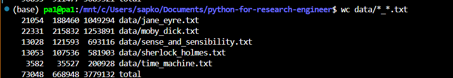

# Exploring Files and Directory 

## ls
ls short term for listing is used to see the current files in the directory 

A more informative output can be achived using -F with ls 
```bash 
ls -F
```  
which prints the following 

-  trailing /  means its a directory. 
- trailing * means its something runnable program. 
 
Also you can use the -a (all) to see more data information on the current directory or the directory of which you want to see. 
```bash 
ls -F -a 
ls -Fa
```
which will gives us the following result


# Moving around 
cd (change directory)

```bash 
cd ..
cd ../.. 
cd -
``` 
-  cd .. can be used to move back a directory 
- cd ../.. can be used to move back twice a directory 
- cd - will help us to move to previously working directory

# Creating New files and Directories 

## mkdir 
can be used to make a directory. 

# Moving and Copying  files and directories 
mv can be used to move files or change the name of the files as well 
```bash 
mv source destination
```
cp can be used for copying the fiels 
```bash 
cp source destination
```
sometimes when there are files inside the directories we cannot just use the cp source dest , cause this will copy the content for this we have to use the -r 
```bash 
cp -r source destination
```
# Removing a directory 

```bash 
rm -rv 
rm -r -v <directory_to_delete>
rm -r -v -i <directory_to_delete>
``` 
- -v will verbose what is being deleted 
- -i can be used to do interactive delete


# wildcards 
## wc 
wc gives us the lines words and letter are there in given file. 


Also we can use the wildcard * to show all the text and their word counts 


Here in the following figure the _ in between the * says that we want the files that can start with anything and somewhere have _ and then continue with other text 


`wilcard can be used with the various other commands like mv , rm ...`
# working through the Manual 
```bash 
man wc 
``` 
This will give us the manual for the wc command 
# Passing Through Manual 
If our screen is too small to display an entire manual page at once, the shell will use a paging program called less to show it piece by piece. We can use ↑ and ↓ to move line-by-line or Ctrl+Spacebar and Spacebar to skip up and down one page at a time. (B and F also work.) To search for a character or word, use / followed by the character or
word to search for. If the search produces multiple hits, we can move between them using N (for “next”). To quit, press Q.


# Exercises
## Exploring ls flag 
ls `-l` list the files that is present in the directory and addidng `-h` will list those files in the human readable file sizes. 


### listing the files with the -t 
```bash 
    ls -t
```
Also we can use the -R flag to see the contents of the directories

### `ls -F` Command in Linux

The `ls -F` command in Linux appends **indicators** to file and directory names to provide more information about their types. This makes it easier to distinguish between different types of files in a directory listing.

## Indicators Added by `ls -F`

| Indicator | Meaning                       | Example       |
|-----------|-------------------------------|---------------|
| `/`       | Directory                     | `Documents/`  |
| `*`       | Executable file               | `script.sh*`  |
| `@`       | Symbolic link                 | `shortcut@`   |
| `|`       | Named pipe (FIFO)             | `pipe|`       |
| `=`       | Socket                        | `socket=`     |
| `>`       | Door (specific to Solaris OS) | `door>`       |

## Example Usage

Running the `ls -F` command in a directory might display:

```bash
$ ls -F
file.txt   script.sh*   Documents/   shortcut@   pipe|   socket=
```


# Keypoints 
